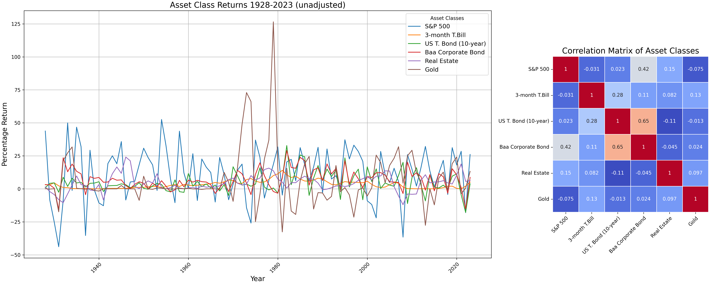
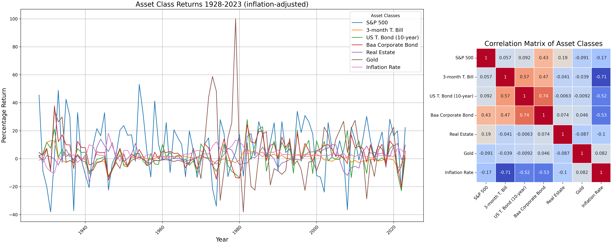

# USA Asset Class Returns and Correlations (1928-2023)

Yearly returns and correlation matrices for major US asset classes over roughly the last 100 years.

## Asset Classes

- S&P 500
- 3-month T-Bill
- US T-Bond (10-year)
- Baa Corporate Bond
- Real Estate
- Gold

## Nominal Returns

## Inflation-Adjusted Returns

## License

This work is licensed under [CC BY 4.0](LICENSE). You are free to use, share, and adapt it as long as you provide attribution.
